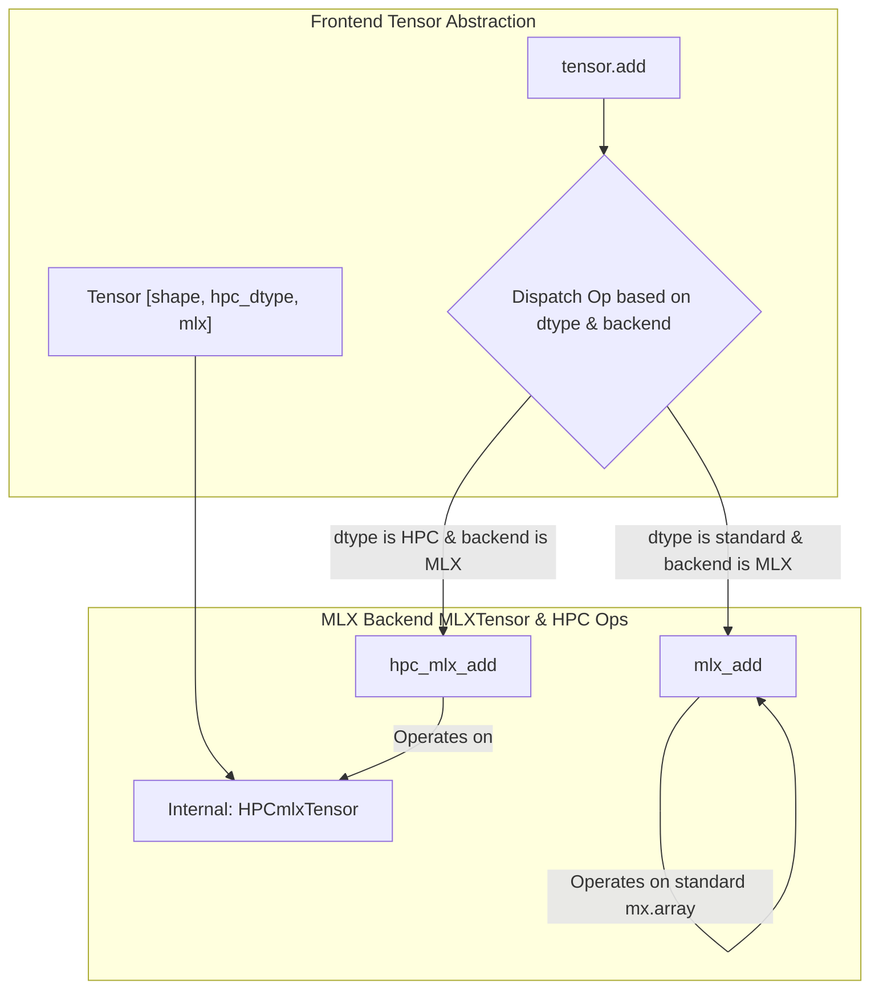

# BizarroMath Architecture: Arbitrary-Precision Tensors

## 1. Objective

The primary goal of the BizarroMath components (`MLXMegaNumber`, `MLXMegaBinary`, backend bitwise modules) is to enable tensor operations within Ember ML using arbitrary-precision data types. This allows for the creation and manipulation of tensors with effective dtypes like `hpc_uint128`, `hpc_float128`, etc., facilitating computations that require precision beyond standard hardware limits.

## 2. Proposed Architecture

To achieve this, the following architectural components and modifications are proposed:

### 2.1. High-Precision Tensor Representation (`HPCmlxTensor`)

*   **Concept:** Introduce a backend-specific tensor class (e.g., `HPCmlxTensor` for the MLX backend) to represent tensors containing arbitrary-precision numbers.
*   **Internal Structure:** This class will wrap a standard `mlx.core.array`. The array's shape will be `(tensor_shape..., num_limbs)`, and its `dtype` will likely be `int16` (matching `MLXMegaNumber`). For example, a `(10, 20)` tensor of `hpc_uint128` (requiring 8 limbs) would internally use an `mx.array` of shape `(10, 20, 8)`.
*   **Interface:** The `HPCmlxTensor` class should expose a standard tensor-like interface (e.g., `.shape`, `.dtype` properties) to interact seamlessly with the rest of the framework.

### 2.2. Frontend Tensor Integration

*   **Type Recognition:** The main frontend `Tensor` abstraction must be updated to recognize new high-precision dtypes (e.g., `hpc_uint128`, `hpc_float128`).
*   **Backend Instantiation:** When a frontend `Tensor` is created with an HPC dtype and a specific backend (e.g., 'mlx'), the backend should instantiate the corresponding HPC tensor representation (e.g., `HPCmlxTensor`).

### 2.3. Backend Operation Dispatch

*   **Mechanism:** The backend abstraction layer (`MLXTensor` or equivalent dispatcher) needs enhancement.
*   **Logic:** When an operation (e.g., `add`, `matmul`) is invoked, the dispatcher must check the `dtype` of the input tensors. If the dtype indicates an HPC type for the current backend, the call must be routed to specialized HPC operation functions instead of the standard backend functions (e.g., `mx.add`).

### 2.4. HPC Operation Implementation

*   **Specialized Functions:** New backend-specific functions (e.g., `hpc_mlx_add`, `hpc_mlx_matmul`) must be implemented.
*   **Element-wise Logic:** These functions will typically operate element-wise across the input `HPCmlxTensor`(s). For each element:
    1.  Extract the limb array(s) from the internal `mx.array`.
    2.  Use `MLXMegaNumber` (or `MLXMegaBinary`) to perform the high-precision calculation using these limbs.
    3.  Store the resulting limbs in the output `HPCmlxTensor`'s internal `mx.array`.
*   **Vectorization:** To achieve good performance, these element-wise operations should be vectorized using backend capabilities like `mlx.core.vmap` wherever feasible.

## 3. Dispatch Flow Diagram

## 4. Related Refactoring (Optional - Plan A)

For improved code structure and maintainability, consider refactoring `MLXMegaBinary`'s bitwise methods (`bitwise_and`, `shift_left`, etc.) to delegate their core logic to the corresponding functions in the `ember_ml.backend.mlx.bitwise` module, rather than duplicating the implementation. This can be done prior to or alongside the `HPCmlxTensor` implementation.