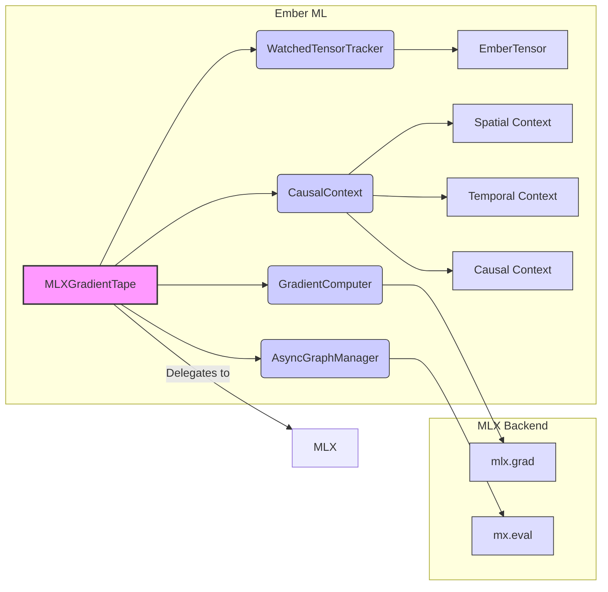

# Architectural Design: MLX-Optimized GradientTape for Ember ML

## 1. Executive Summary

This document outlines the architectural design for implementing a GradientTape specifically optimized for the MLX backend in Ember ML. This implementation will leverage MLX's existing gradient computation capabilities and Module system while providing a TensorFlow-like GradientTape API for familiarity and consistency. The design also accounts for asynchronous neural backbones, graph-based execution models, and the unique requirements of spatially-embedded recurrent spiking neural networks (seRSNNs).

## 2. Key Considerations

1.  **MLX Gradient Computation**: Leverage MLX's `mlx.grad` and `mlx.nn.value_and_grad` for gradient computation.
2.  **MLX Module System**: Integrate with MLX's Module system for parameter tracking.
3.  **Asynchronous Execution**: Handle asynchronous execution and graph-based computation.
4.  **seRSNN Requirements**:
    *   **Proximity**: Track spatial relationships between neurons or operations.
    *   **Causality**: Track temporal relationships between events, including what caused a neuron to fire.
    *   **Influence**: Track the degree to which one event influences another.

## 3. Architectural Approach

Our GradientTape implementation for MLX will address these challenges by:

1.  **Adapting the API**: Providing a TensorFlow-like GradientTape API that internally uses MLX's function transformation approach.
2.  **Leveraging the Module System**: Using MLX's Module system for parameter tracking when working with models.
3.  **Handling Asynchronous Execution**: Ensuring that the computation graph is properly constructed and synchronized before computing gradients.
4.  **Implementing a "Holographic" Tape**: Capturing spatial, temporal, and causal relationships between operations via a `CausalContext`.

## 4. MLX GradientTape Design

### 4.1 Architecture Diagram



### 4.2 Core Components

1.  **MLXGradientTape**: The main class implementing the GradientTape API.
2.  **WatchedTensorTracker**: Tracks tensors being watched for gradient computation.
3.  **GradientComputer**: Handles the actual gradient computation using MLX's grad functions.
4.  **AsyncGraphManager**: Manages asynchronous execution and graph-based computation, ensuring synchronization via `mx.eval()`.
5.  **CausalContext**: Captures spatial, temporal, and causal relationships between operations, enabling accurate gradient computation for complex models like seRSNNs.

### 4.3 MLXGradientTape API (Conceptual)

```python
class MLXGradientTape:
    def __init__(self, persistent=False, watch_accessed_variables=True):
        # ... initialization of components ...
        pass

    def __enter__(self):
        # Start recording in AsyncGraphManager and CausalContext
        pass

    def __exit__(self, exc_type, exc_value, traceback):
        # Stop recording
        pass

    def watch(self, tensor):
        # Register tensor with WatchedTensorTracker, AsyncGraphManager, CausalContext
        pass

    def gradient(self, target, sources, unconnected_gradients="none"):
        # Ensure synchronization via AsyncGraphManager
        # Convert tensors to MLX format
        # Use GradientComputer (which uses mlx.grad) with a function reconstructed by CausalContext
        # Convert results back to EmberTensors
        pass

    def jacobian(self, target, source, unconnected_gradients="none"):
        # Similar flow as gradient, using mlx.jacobian (or equivalent)
        pass

    def batch_jacobian(self, target, source, unconnected_gradients="none"):
        # Similar flow as gradient, using mlx.vmap or equivalent for batching
        pass

    def watched_variables(self):
        # Return variables tracked by WatchedTensorTracker
        pass
```

### 4.4 CausalContext (Conceptual)

```python
class CausalContext:
    def start_recording(self): pass
    def stop_recording(self): pass
    def register_tensor(self, tensor): pass

    def register_operation(self, operation, inputs, outputs):
        # Store operation details along with derived spatial, temporal, causal context
        pass

    def _get_spatial_context(self, inputs, outputs):
        # Determine spatial relationships (e.g., neuron coordinates)
        pass

    def _get_temporal_context(self, inputs, outputs):
        # Determine timing relationships (e.g., spike times)
        pass

    def _get_causal_context(self, inputs, outputs):
        # Determine causal links (e.g., which input caused an output spike)
        pass

    def reconstruct_graph(self, target, sources, *args):
        # Re-execute operations based on stored context to compute target from sources
        # This is crucial for mlx.grad
        pass
```

### 4.5 Module Integration

For MLX Modules, leverage `mlx.nn.value_and_grad` for efficient gradient computation with respect to trainable parameters.

```python
def compute_module_gradients(model, loss_fn, inputs, targets):
    def loss_function(params):
        model.update(params)
        outputs = model(inputs)
        loss = loss_fn(outputs, targets)
        return loss

    loss_and_grad_fn = mlx.nn.value_and_grad(loss_function)
    loss, grads = loss_and_grad_fn(model.trainable_parameters())
    return loss, grads
```

## 5. Handling Asynchronous Execution and Graphs

The `AsyncGraphManager` ensures synchronization before gradient computation by calling `mx.eval()` on relevant tensors. The `CausalContext` aids in reconstructing the computation graph accurately, even with asynchronous or graph-based execution, by storing contextual information alongside operations.

## 6. Integration with Ember ML

The `MLXGradientTape` will be implemented within the MLX backend (`ember_ml/backend/mlx/gradient_tape.py`). The main `GradientTape` class in `ember_ml/training/optimizer/gradient_tape.py` will act as a frontend, instantiating and delegating to the appropriate backend implementation based on the currently selected backend.

## 7. Future Extensions

1.  **Global Registration System**: Once the MLX implementation is validated, integrate it into a global system that registers frontend operations with backend-specific gradient implementations.
2.  **Other Backends**: Implement similar backend-specific tapes for PyTorch (leveraging `torch.autograd`) and NumPy (using numerical differentiation).

## 8. Conclusion

This design focuses on creating a robust and performant GradientTape for the MLX backend, leveraging its unique features while providing a familiar API. The inclusion of the `CausalContext` addresses the complexities of advanced models like seRSNNs and asynchronous execution patterns. This MLX implementation will serve as the foundation for a truly backend-agnostic automatic differentiation system in Ember ML.