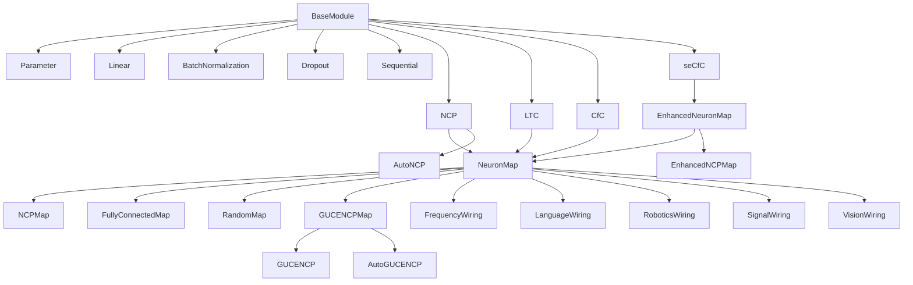
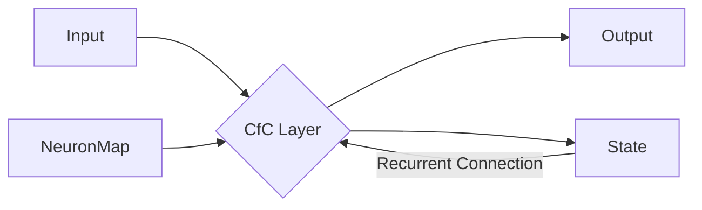
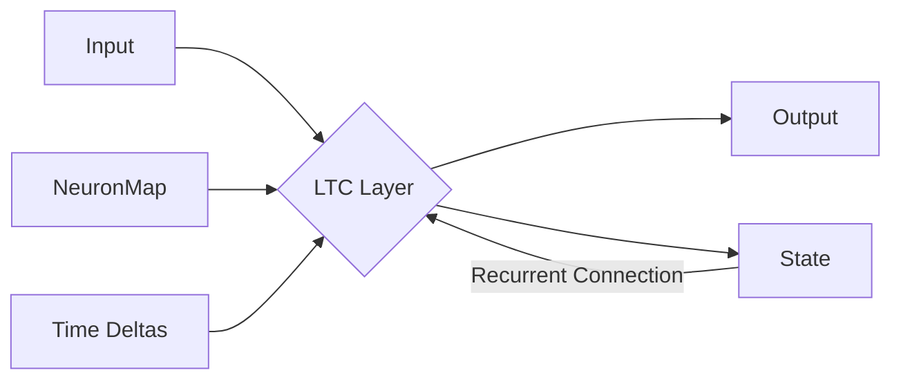

# Neural Wiring and Backbone Architectures in Ember ML

## Introduction to Neural Architectures in Ember ML

Ember ML employs a diverse set of neural processing paradigms, including Restricted Boltzmann Machines (RBMs), Liquid Neural Networks (CfC and LTC), and a comprehensive suite of Wave-based approaches. This document provides a detailed guide to the core components and their interconnections, focusing on the current architectural patterns that emphasize the integration of wiring directly within layer implementations.

It is worth noting that the project's architecture is evolving, with a shift away from explicit "Cell" and "Wired" classes for recurrence and wiring towards a more integrated approach where `NeuronMap` instances define the internal structure of layers like `CfC` and `LTC`.

## Core Neural Network Components (`ember_ml.nn`)

The `ember_ml.nn` package provides the foundational building blocks for constructing neural networks in Ember ML, designed to be backend-agnostic through the `ops` and `tensor` abstraction layers.

### Base Module (`ember_ml.nn.modules.base_module`)

The `BaseModule` class serves as the fundamental building block for all neural network components in Ember ML. It provides essential infrastructure for managing parameters, composing modules, and handling training/evaluation modes, as well as device and data type conversions.

-   **`Parameter`**: A special type of tensor (`ember_ml.nn.modules.base_module.Parameter`) that represents a trainable parameter within a module. It tracks data and whether it requires gradients.
-   **`BaseModule`**:
    -   Manages collections of `_parameters`, `_modules` (submodules), and `_buffers`.
    -   Includes methods for registering parameters, buffers, and submodules (`register_parameter`, `register_buffer`, `add_module`).
    -   Provides iterators for accessing named parameters, buffers, and modules (`named_parameters`, `parameters`, `named_buffers`, `buffers`, `named_modules`, `modules`).
    -   Handles training and evaluation modes (`train`, `eval`).
    -   Supports moving parameters and buffers to different devices and casting to different data types (`to`).
    -   Provides a deferred `build` method that is called automatically before the first `forward` pass, allowing modules to create weights based on input shape.
    -   Implements `__call__` to manage the `build` process and then execute the `forward` method.
    -   Includes methods for managing gradients (`zero_grad`).
    -   Supports serialization and deserialization through `get_config` and `from_config`.

### Standard Layers (`ember_ml.nn.container` and `ember_ml.nn.modules`)

Ember ML provides implementations of common neural network layers.

-   **`Linear` (`ember_ml.nn.container.linear.Linear`)**: Implements a standard fully connected layer (`y = x @ W.T + b`). It initializes weights (using Kaiming initialization by default) and biases and performs the linear transformation using `ops.matmul` and `ops.add`.
-   **`BatchNormalization` (`ember_ml.nn.container.batch_normalization.BatchNormalization`)**: Normalizes activations across a batch. It tracks moving mean and variance during training and uses these statistics during evaluation. It utilizes `ops.stats.mean`, `tensor.var`, `ops.subtract`, `ops.divide`, `ops.sqrt`, `ops.multiply`, and `ops.add`.
-   **`Dropout` (`ember_ml.nn.container.dropout.Dropout`)**: Randomly sets a fraction of input units to zero during training to prevent overfitting. It uses `tensor.random_uniform`, `ops.greater_equal`, `tensor.cast`, and `ops.multiply`.

### Containers (`ember_ml.nn.container.sequential`)

Containers are used to compose multiple layers into a single module.

-   **`Sequential` (`ember_ml.nn.container.sequential.Sequential`)**: A simple container that passes input through a sequence of modules in the order they are added. It manages the `forward` pass, `build` process, configuration, and state for its contained layers.

### Neural Circuit Policy (NCP) and Variations (`ember_ml.nn.modules` and `ember_ml.nn.modules.wiring`)

The NCP framework in Ember ML provides a structured approach to building recurrent neural networks with biologically inspired connectivity patterns defined by `NeuronMap` instances.

-   **`NeuronMap` (`ember_ml.nn.modules.wiring.neuron_map.NeuronMap`)**: The base class for all wiring configurations. It defines the interface for specifying connectivity patterns between neurons.
    -   Manages the number of `units`, `input_dim`, and `output_dim`.
    -   Includes a `build` method (to be overridden by subclasses) that generates the `_input_mask`, `_recurrent_mask`, and `_output_mask` tensors based on the defined wiring pattern.
    -   Provides methods to retrieve these masks (`get_input_mask`, `get_recurrent_mask`, `get_output_mask`).
    -   Includes methods for adding synapses to internal and sensory adjacency matrices (`add_synapse`, `add_sensory_synapse`).
    -   Tracks synapse counts (`synapse_count`, `sensory_synapse_count`).
    -   Supports configuration through `get_config` and `from_config`.

-   **`NCPMap` (`ember_ml.nn.modules.wiring.ncp_map.NCPMap`)**: A specific `NeuronMap` implementation that structures neurons into sensory, inter, command, and motor groups. It defines connectivity based on sparsity levels between these groups and includes cell-specific parameters that influence neuron dynamics.

-   **`FullyConnectedMap` (`ember_ml.nn.modules.wiring.fully_connected_map.FullyConnectedMap`)**: A `NeuronMap` where all neurons are connected to all other neurons, and all inputs are connected to all neurons, with connectivity potentially influenced by a sparsity level.

-   **`RandomMap` (`ember_ml.nn.modules.wiring.random_map.RandomMap`)**: A `NeuronMap` where connections are randomly generated based on a specified sparsity level.

-   **`EnhancedNeuronMap` (`ember_ml.nn.modules.wiring.enhanced_neuron_map.EnhancedNeuronMap`)**: Extends `NeuronMap` to support arbitrary neuron types, dynamic properties, and spatial embedding, including the calculation of a distance matrix.

-   **`EnhancedNCPMap` (`ember_ml.nn.modules.wiring.enhanced_ncp_map.EnhancedNCPMap`)**: Extends `EnhancedNeuronMap` to implement the NCP connectivity pattern with support for spatial properties and neuron-type specific dynamics, including the calculation of communicability.

-   **`GUCENCPMap` (`ember_ml.nn.modules.wiring.guce_ncp_map.GUCENCPMap`)**: Integrates GUCE neuron dynamics with a structured NCP connectivity pattern, including specific fanout and fanin parameters.

-   **Specialized Wiring Patterns (`ember_ml.nn.modules.wiring`):**
    -   **`FrequencyWiring`**: Designed for signal decomposition with frequency-specific neurons and harmonic connections.
    -   **`LanguageWiring`**: Designed for NLP tasks with a structure similar to transformer architectures (multi-head attention, position-wise processing).
    -   **`RoboticsWiring`**: Designed for robotics applications with layers for sensor processing, state estimation, and control.
    -   **`SignalWiring`**: Designed for multi-scale signal processing with multiple frequency bands and cross-band interactions.
    -   **`VisionWiring`**: Designed for computer vision tasks with local receptive fields, feature hierarchies, and skip connections.

-   **`NCP` (`ember_ml.nn.modules.ncp.NCP`)**: A recurrent neural network layer that utilizes a `NeuronMap` instance to define its internal connectivity and behavior. It implements a deferred `build` method to initialize weights and masks based on the input shape and the provided `NeuronMap`. The forward pass involves masked matrix multiplications and activation functions.

-   **`AutoNCP` (`ember_ml.nn.modules.auto_ncp.AutoNCP`)**: A convenience wrapper around the `NCP` class that automatically configures an `NCPMap` based on the number of units and outputs.

-   **`GUCENCP` (`ember_ml.nn.modules.wiring.guce_ncp.GUCENCP`) and `AutoGUCENCP` (`ember_ml.nn.modules.wiring.guce_ncp.AutoGUCENCP`)**: Variations of the NCP that integrate GUCE neuron dynamics with NCP-like wiring patterns.

*Figure 1: Simplified Hierarchy of Core Neural Network Components and Wiring*

## RNN Backbones with Integrated Wiring

Ember ML's recurrent neural network backbones, such as CfC and LTC, are implemented to directly integrate with `NeuronMap` instances, allowing for flexible and structured connectivity.

### Closed-form Continuous-time (CfC)

The `CfC` layer (`ember_ml.nn.modules.rnn.cfc.CfC`) is a continuous-time RNN that utilizes a `NeuronMap` (typically an `NCPMap`) to define its internal structure and dynamics. It implements the CfC logic based on input projections, gating mechanisms (input, forget, output, cell), and state updates, with time scaling applied to the decay.

*Figure 2: CfC Layer Data Flow with NeuronMap Integration*

### Liquid Time-Constant (LTC)

The `LTC` layer (`ember_ml.nn.modules.rnn.ltc.LTC`) is another continuous-time RNN backbone that directly uses a `NeuronMap` (typically an `NCPMap`) for its structure and dynamics. It implements the Liquid Time-Constant dynamics, including an ODE solver that updates the neuron states based on leak, synaptic, and sensory currents, all influenced by the connectivity defined by the `NeuronMap`. It also supports optional mixed memory.

*Figure 3: LTC Layer Data Flow with NeuronMap Integration and Time Deltas*

### Spatially Embedded CfC (seCfC)

The `seCfC` layer (`ember_ml.nn.modules.rnn.se_cfc.seCfC`) extends the CfC concept by integrating spatial embedding and regularization. It utilizes an `EnhancedNeuronMap` to incorporate spatial constraints and neuron-type specific dynamics into the continuous-time processing.

### Note on Stride-Aware CfC

The `StrideAwareCfC` layer (`ember_ml.nn.modules.rnn.stride_aware_cfc_layer.StrideAwareCfC`) and the underlying `StrideAwareWiredCfCCell` (`ember_ml.nn.modules.rnn.stride_aware_cfc.StrideAwareWiredCfCCell`) represent a pattern that might be undergoing architectural changes, particularly with the project's evolution away from explicit "Cell" and "Wired" classes. These components incorporate stride-aware processing and utilize a `NeuronMap` or a specific cell implementation. Their current status should be considered in the context of the broader architectural shift towards more direct integration of wiring within layers.

## Wiring and Interconnections

The concept of "wiring" in Ember ML, primarily implemented through the `NeuronMap` hierarchy, is central to defining the internal connectivity and behavior of neural network layers, particularly in the NCP and continuous-time RNN backbones.

-   **Defining Connectivity:** `NeuronMap` instances specify which neurons are connected to which others through adjacency matrices and masks. These masks are then used within the layer's forward pass (e.g., in `NCP`, `CfC`, `LTC`) to apply the defined connectivity pattern to matrix multiplications and other operations.
-   **Influencing Layer Behavior:** Different `NeuronMap` derivatives encode distinct architectural principles (e.g., grouped neurons in `NCPMap`, spatial constraints in `EnhancedNeuronMap`, frequency-specific connections in `FrequencyWiring`). When a layer is initialized with a specific `NeuronMap`, its internal computations and information flow are directly shaped by this wiring, leading to specialized behaviors suited for different tasks (e.g., control with NCP, signal processing with `SignalWiring`, vision with `VisionWiring`).
-   **Composition:** Traditional containers like `Sequential` allow for composing layers with defined wiring into larger network architectures, where the output of one wired layer serves as the input to the next.

## Common Patterns and Duplicates

(Based on the current scope, there are no immediately apparent significant duplicate *classes* serving identical roles across different paradigms, but rather different *implementations* of wiring patterns inheriting from a common base (`NeuronMap`). The "Wave" module has its own set of "Network" classes, but these appear to represent a distinct processing paradigm rather than direct duplicates of the core `nn` modules. This section can be expanded if further analysis reveals more specific common patterns or potential areas for refactoring.)

## Conclusion

Ember ML's neural network architecture is characterized by a flexible and modular design, with the `NeuronMap` hierarchy playing a key role in defining the "wiring" or internal connectivity of layers. This approach allows for the implementation of diverse neural paradigms, from structured NCPs to continuous-time RNNs and specialized wiring patterns for various domains. The ongoing architectural evolution towards integrating wiring directly within layers simplifies the structure and enhances the clarity of how connectivity influences neural computation. Further documentation and analysis can delve deeper into the specific dynamics and applications of each wired component and explore potential areas for future development and optimization.