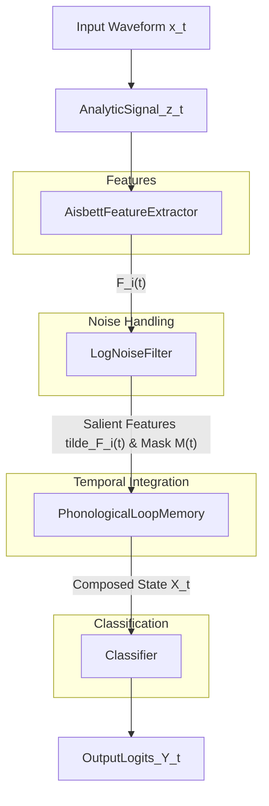

# Phonological Loop Neural Network: Technical Architecture

## Overview

The Phonological Loop Neural Network (PLNN) is a biomimetic architecture inspired by human working memory systems, specifically designed for robust signal classification in noisy environments. This document provides a detailed technical description of the architecture, implementation considerations, and computational flow.

## System Architecture

The PLNN consists of five main components arranged in a sequential pipeline:



### 1. Analytic Signal Transformation

**Input:** Raw waveform $x(t)$
**Output:** Complex analytic signal $z(t) = x(t) + j\hat{x}(t)$

The analytic signal is computed using the Hilbert transform to obtain the quadrature component:

```python
def analytic_signal(waveform: torch.Tensor) -> torch.Tensor:
    """Computes the analytic signal using FFT."""
    N = waveform.shape[-1]
    X = torch.fft.fft(waveform, N, dim=-1)
    h = torch.zeros_like(X)
    if N % 2 == 0:
        h[..., 0] = h[..., N // 2] = 1
        h[..., 1:N // 2] = 2
    else:
        h[..., 0] = 1
        h[..., 1:(N + 1) // 2] = 2
    analytic = torch.fft.ifft(X * h, dim=-1)
    return analytic  # Complex tensor: I + jQ
```

### 2. Aisbett Feature Extractor

**Input:** Analytic signal $z(t)$
**Output:** Feature set $F(t) = [A^2(t), AA'(t), A^2\theta'(t)]$ with mean and variance statistics

The Aisbett features are derived from the analytic signal:
- $A^2(t)$: Instantaneous power
- $AA'(t)$: Rate of change of amplitude
- $A^2\theta'(t)$: Instantaneous frequency weighted by power

These features are computed over sliding windows, and both mean and variance statistics are calculated for each window, resulting in a 6-dimensional feature vector per window.

```python
class AisbettFeatureExtractorMeanVar(nn.Module):
    def __init__(self, hop_length=128, window_length=512):
        super().__init__()
        self.hop_length = hop_length
        self.window_length = window_length
        self.num_base_features = 3  # A², AA', A²θ'
        
    def forward(self, waveform):
        # Compute analytic signal
        z = analytic_signal(waveform)
        
        # Extract amplitude and phase
        amplitude = torch.abs(z)
        phase = torch.angle(z)
        
        # Compute derivatives
        amplitude_deriv = compute_derivative(amplitude)
        phase_deriv = compute_derivative(phase)
        
        # Compute Aisbett features
        power = amplitude ** 2
        amplitude_change = amplitude * amplitude_deriv
        weighted_freq = power * phase_deriv
        
        # Extract windows and compute statistics
        features = extract_windows_and_compute_stats(
            [power, amplitude_change, weighted_freq],
            self.hop_length, 
            self.window_length
        )
        
        return features
```

### 3. Log-Domain Noise Filter

**Input:** Feature windows $F(t)$
**Output:** Filtered features $\tilde{F}(t)$ and salience mask $M(t)$

The log-domain noise filter applies a logarithmic transformation to the features and filters them based on statistical deviation from estimated noise characteristics:

```python
class LogNoiseFilter(nn.Module):
    def __init__(self, noise_est_samples=100, threshold=3.0, eps=1e-8):
        super().__init__()
        self.noise_est_samples = noise_est_samples
        self.threshold = threshold
        self.eps = eps
        
        # Buffers for noise statistics
        self.register_buffer('noise_mean', torch.zeros(1))
        self.register_buffer('noise_std', torch.ones(1))
        self.register_buffer('stats_estimated', torch.tensor(False))
    
    def estimate_noise_stats(self, features):
        # Use initial segment to estimate noise statistics
        noise_segment = features[:, :self.noise_est_samples, :]
        log_noise = torch.log(torch.clamp(noise_segment, min=self.eps))
        self.noise_mean = torch.mean(log_noise, dim=(0, 1))
        self.noise_std = torch.std(log_noise, dim=(0, 1))
        self.noise_std = torch.clamp(self.noise_std, min=self.eps)
        self.stats_estimated = torch.tensor(True)
    
    def forward(self, features):
        # Estimate noise stats if not already done
        if not self.stats_estimated and self.training:
            self.estimate_noise_stats(features)
        
        # Apply log transform
        log_features = torch.log(torch.clamp(features, min=self.eps))
        
        # Calculate deviation from noise statistics
        expanded_mean = self.noise_mean.view(1, 1, -1)
        expanded_std = self.noise_std.view(1, 1, -1)
        deviation = torch.abs(log_features - expanded_mean) / expanded_std
        
        # Create binary mask where deviation exceeds threshold
        mask = (deviation > self.threshold).float()
        
        # Apply mask to original features
        filtered_features = features * mask
        
        return filtered_features, mask
```

### 4. Phonological Loop Memory

**Input:** Filtered features $\tilde{F}(t)$ and mask $M(t)$
**Output:** Composed memory state $\mathcal{X}_t$

The phonological loop memory maintains a buffer of recent feature windows, applies exponential decay, and implements a rehearsal mechanism based on salience:

```python
class PhonologicalLoopMemory(nn.Module):
    def __init__(self, feature_dim=6, window_len=125, buffer_len=10, 
                 decay_factor=0.9, salience_threshold=3.0, num_recent_windows=3):
        super().__init__()
        self.feature_dim = feature_dim
        self.window_len = window_len
        self.buffer_len = buffer_len
        self.decay_factor = decay_factor
        self.salience_threshold = salience_threshold
        self.num_recent_windows = min(num_recent_windows, buffer_len)
        
        # Initialize buffer and masks
        self.register_buffer('feature_buffer', 
                            torch.zeros(buffer_len, feature_dim, window_len))
        self.register_buffer('mask_buffer', 
                            torch.zeros(buffer_len, feature_dim, window_len))
        
        # Initialize rehearsal state
        self.register_buffer('rehearsal_state', 
                            torch.zeros(feature_dim, window_len))
        
        # Buffer position tracker
        self.current_pos = 0
        self.buffer_filled = False
    
    def forward(self, features, masks):
        batch_size = features.shape[0]
        composed_states = []
        
        for b in range(batch_size):
            current_features = features[b]
            current_mask = masks[b]
            
            # Apply decay to buffer
            self.feature_buffer = self.feature_buffer * self.decay_factor
            
            # Add new window to buffer
            self.feature_buffer[self.current_pos] = current_features
            self.mask_buffer[self.current_pos] = current_mask
            
            # Update buffer position
            old_pos = self.current_pos
            self.current_pos = (self.current_pos + 1) % self.buffer_len
            if self.current_pos == 0:
                self.buffer_filled = True
            
            # Rehearsal mechanism
            rehearsal_triggered = False
            search_range = self.buffer_len if self.buffer_filled else old_pos + 1
            
            for i in range(search_range):
                pos = (old_pos - i) % self.buffer_len
                if pos < 0:
                    pos += self.buffer_len
                
                # Check if this window has salient features
                mask_sum = torch.sum(self.mask_buffer[pos])
                if mask_sum > self.salience_threshold:
                    # Set rehearsal state to this window
                    self.rehearsal_state = self.feature_buffer[pos].clone()
                    rehearsal_triggered = True
                    break
            
            if not rehearsal_triggered:
                self.rehearsal_state = torch.zeros_like(self.rehearsal_state)
            
            # Compose state for classifier
            recent_windows = []
            for i in range(self.num_recent_windows):
                pos = (old_pos - i) % self.buffer_len
                if pos < 0:
                    pos += self.buffer_len
                
                if i < search_range:
                    recent_windows.append(self.feature_buffer[pos])
                else:
                    recent_windows.append(torch.zeros_like(current_features))
            
            # Concatenate recent windows and rehearsal state
            state_components = recent_windows + [self.rehearsal_state]
            composed_state = torch.cat([window.flatten() for window in state_components])
            composed_states.append(composed_state)
        
        return torch.stack(composed_states)
```

### 5. S4 Layer (Optional)

**Input:** Memory state $\mathcal{X}_t$
**Output:** Temporally processed state

The S4 layer provides additional temporal processing capabilities using a structured state space model:

```python
# S4 layer processes the memory output
memory_output_dim = feature_dim * (num_recent_windows + 1) * window_len
memory_projection = nn.Linear(memory_output_dim, s4_d_model)
projected = memory_projection(memory_output)
s4_input = projected.unsqueeze(-1)  # Add sequence dimension
s4_output, _ = s4_layer(s4_input)
classifier_input = s4_output.squeeze(-1)
```

### 6. Classification Layer

**Input:** Processed memory state
**Output:** Classification logits

A simple MLP classifier processes the final state to produce classification logits:

```python
class SimpleMLPClassifier(nn.Module):
    def __init__(self, input_dim, num_classes, hidden_dim=128):
        super().__init__()
        self.layer_1 = nn.Linear(input_dim, hidden_dim)
        self.layer_2 = nn.Linear(hidden_dim, num_classes)
        
    def forward(self, x):
        x = self.layer_1(x)
        x = F.relu(x)
        x = self.layer_2(x)
        return x
```

## Training Methodology

The PLNN is trained using a two-phase approach:

### Phase 1: Noise Pretraining
- Train only on noise samples for a fixed number of epochs
- Allows the model to learn baseline noise characteristics
- Establishes effective noise filtering parameters

### Phase 2: Full Training
- Train on all sample types (AM, FM, Noise)
- Builds on the noise baseline to learn signal characteristics
- Fine-tunes the entire architecture

This approach enables the model to first establish a solid understanding of what constitutes noise, then learn to differentiate signals from this baseline.

## Computational Considerations

- **Memory Usage**: The buffer-based approach requires maintaining state across batches, which can impact memory usage.
- **Parallelization**: The sequential nature of the phonological loop memory makes batch parallelization challenging.
- **Inference Speed**: Despite the complexity, inference is remarkably fast due to the efficient approximation properties.
- **Training Efficiency**: The model converges extremely quickly, typically requiring only seconds of training time.

## Implementation Notes

- The architecture is implemented in PyTorch, leveraging its automatic differentiation capabilities.
- Buffer states are maintained using PyTorch's `register_buffer` mechanism to ensure proper device placement.
- The S4 layer implementation uses a PyTorch fallback for the Cauchy and Vandermonde kernels, but could be optimized further with specialized CUDA extensions.

## Performance Metrics

On the RF modulation classification task:
- **Accuracy**: 100% on test set
- **Confidence**: 
  - AM: 0.57-0.89
  - FM: 0.94-0.98
  - Noise: 0.99-1.00
- **Training Time**: ~3 seconds for complete training
- **Convergence**: Significant learning by epoch 3-4

## Future Optimizations

- **Parallel Buffer Processing**: Implementing more efficient parallel processing of the buffer operations
- **Specialized CUDA Kernels**: Developing optimized implementations of the S4 kernels
- **Quantization**: Exploring reduced precision representations for deployment on resource-constrained devices
- **Adaptive Threshold**: Implementing dynamic adjustment of the salience threshold based on signal characteristics