# MegaNumber Refactoring: Comprehensive Design Document

## 1. Executive Summary

This document outlines the comprehensive plan for completing the refactoring of the MegaNumber system in the EmberML Kotlin library. The refactoring aims to transform the monolithic MegaNumber class into a modular, maintainable system using interface-based design and the delegation pattern.

The missing pieces identified in the current implementation are:
1. **DefaultArithmeticCalculator**: Implementation of BasicArithmeticOperations
2. **DefaultFloatOperations**: Implementation of FloatSpecificOperations

This document provides a detailed plan for implementing these missing components and completing the transition to a fully delegated architecture.

## 2. Current Architecture

### 2.1 Component Overview

The current architecture consists of:

```mermaid
classDiagram
    class MegaNumber {
        +mantissa: IntArray
        +exponent: MegaNumber
        +negative: Boolean
        +isFloat: Boolean
        +keepLeadingZeros: Boolean
        +add(other: MegaNumber): MegaNumber
        +sub(other: MegaNumber): MegaNumber
        +mul(other: MegaNumber): MegaNumber
        +divide(other: MegaNumber): MegaNumber
        +addFloat(other: MegaNumber): MegaNumber
        +mulFloat(other: MegaNumber): MegaNumber
        +sqrt(): MegaNumber
        +toDecimalString(): String
    }
    
    class MegaFloat {
        +add(other: MegaFloat): MegaFloat
        +sub(other: MegaFloat): MegaFloat
        +mul(other: MegaFloat): MegaFloat
        +div(other: MegaFloat): MegaFloat
        +pow(exponent: MegaNumber): MegaNumber
    }
    
    class MegaInteger {
        +add(other: MegaInteger): MegaInteger
        +sub(other: MegaInteger): MegaInteger
        +mul(other: MegaInteger): MegaInteger
        +div(other: MegaInteger): MegaInteger
        +mod(other: MegaInteger): MegaInteger
        +pow(exponent: MegaNumber): MegaNumber
    }
    
    MegaNumber <|-- MegaFloat
    MegaNumber <|-- MegaInteger
    
    class BasicArithmeticOperations {
        <<interface>>
        +add(other: MegaNumber): MegaNumber
        +sub(other: MegaNumber): MegaNumber
        +mul(other: MegaNumber): MegaNumber
        +divide(other: MegaNumber): MegaNumber
    }
    
    class FloatSpecificOperations {
        <<interface>>
        +addFloat(other: MegaNumber): MegaNumber
        +mulFloat(other: MegaNumber): MegaNumber
    }
    
    class AdvancedMathOperations {
        <<interface>>
        +sqrt(): MegaNumber
    }
    
    class PowerOperations {
        <<interface>>
        +pow(exponent: MegaNumber): MegaNumber
    }
    
    class ConversionOperations {
        <<interface>>
        +toDecimalString(): String
    }
    
    class BitManipulationOperations {
        <<interface>>
    }
    
    class ChunkOperations {
        <<interface>>
    }
    
    MegaNumber ..|> BasicArithmeticOperations
    MegaNumber ..|> FloatSpecificOperations
    MegaNumber ..|> AdvancedMathOperations
    MegaNumber ..|> BitManipulationOperations
    MegaNumber ..|> ChunkOperations
    MegaNumber ..|> ConversionOperations
    MegaFloat ..|> PowerOperations
    MegaInteger ..|> PowerOperations
    
    class DefaultChunkOperations {
        +addChunks(a: IntArray, b: IntArray): IntArray
        +subChunks(a: IntArray, b: IntArray, preserveSize: Boolean): IntArray
        +mulChunks(a: IntArray, b: IntArray): IntArray
        +compareAbs(a: IntArray, b: IntArray): Int
    }
    
    class DefaultBitManipulationOperations {
        +shiftLeft(limbs: IntArray, shift: Int): IntArray
        +shiftRight(limbs: IntArray, shiftBits: Int): IntArray
        +multiplyBy2ToThePower(chunks: IntArray, bits: Int): IntArray
        +divideBy2ToThePower(chunks: IntArray, bits: Int): Pair<IntArray, IntArray>
    }
    
    class DefaultConversionOperations {
        +toDecimalString(): String
    }
    
    class DefaultAdvancedMathOperations {
        +sqrt(): MegaNumber
    }
    
    class DefaultPowerOperations {
        +pow(exponent: MegaNumber): MegaNumber
    }
    
    class ArithmeticUtils {
        +add(a: MegaNumber, b: MegaNumber): MegaNumber
        +subtract(a: MegaNumber, b: MegaNumber): MegaNumber
        +multiply(a: MegaNumber, b: MegaNumber): MegaNumber
        +divide(a: MegaNumber, b: MegaNumber): MegaNumber
    }
    
    ChunkOperations <|.. DefaultChunkOperations
    BitManipulationOperations <|.. DefaultBitManipulationOperations
    ConversionOperations <|.. DefaultConversionOperations
    AdvancedMathOperations <|.. DefaultAdvancedMathOperations
    PowerOperations <|.. DefaultPowerOperations
```



### 2.2 Current Implementation Status

The following components have been implemented:

1. **Interfaces**:
   - BasicArithmeticOperations
   - FloatSpecificOperations
   - AdvancedMathOperations
   - BitManipulationOperations
   - ChunkOperations
   - ConversionOperations
   - PowerOperations

2. **Implementation Classes**:
   - DefaultChunkOperations
   - DefaultBitManipulationOperations
   - DefaultConversionOperations
   - DefaultAdvancedMathOperations
   - DefaultPowerOperations

3. **Utility Classes**:
   - ArithmeticUtils (provides static methods for arithmetic operations)

4. **Delegation in MegaNumber**:
   - `toDecimalString()` delegates to DefaultConversionOperations
   - `sqrt()` delegates to DefaultAdvancedMathOperations

### 2.3 Missing Components

The following components are missing:

1. **DefaultArithmeticCalculator**: Implementation of BasicArithmeticOperations
2. **DefaultFloatOperations**: Implementation of FloatSpecificOperations

## 3. Target Architecture

### 3.1 Component Overview

The target architecture will be:

```mermaid
classDiagram
    class MegaNumber {
        +mantissa: IntArray
        +exponent: MegaNumber
        +negative: Boolean
        +isFloat: Boolean
        +keepLeadingZeros: Boolean
    }
    
    class MegaFloat {
        +add(other: MegaFloat): MegaFloat
        +sub(other: MegaFloat): MegaFloat
        +mul(other: MegaFloat): MegaFloat
        +div(other: MegaFloat): MegaFloat
    }
    
    class MegaInteger {
        +add(other: MegaInteger): MegaInteger
        +sub(other: MegaInteger): MegaInteger
        +mul(other: MegaInteger): MegaInteger
        +div(other: MegaInteger): MegaInteger
        +mod(other: MegaInteger): MegaInteger
    }
    
    MegaNumber <|-- MegaFloat
    MegaNumber <|-- MegaInteger
    
    class BasicArithmeticOperations {
        <<interface>>
        +add(other: MegaNumber): MegaNumber
        +sub(other: MegaNumber): MegaNumber
        +mul(other: MegaNumber): MegaNumber
        +divide(other: MegaNumber): MegaNumber
    }
    
    class FloatSpecificOperations {
        <<interface>>
        +addFloat(other: MegaNumber): MegaNumber
        +mulFloat(other: MegaNumber): MegaNumber
    }
    
    class AdvancedMathOperations {
        <<interface>>
        +sqrt(): MegaNumber
    }
    
    class PowerOperations {
        <<interface>>
        +pow(exponent: MegaNumber): MegaNumber
    }
    
    class ConversionOperations {
        <<interface>>
        +toDecimalString(): String
    }
    
    class BitManipulationOperations {
        <<interface>>
    }
    
    class ChunkOperations {
        <<interface>>
    }
    
    MegaNumber ..|> BasicArithmeticOperations
    MegaNumber ..|> FloatSpecificOperations
    MegaNumber ..|> AdvancedMathOperations
    MegaNumber ..|> BitManipulationOperations
    MegaNumber ..|> ChunkOperations
    MegaNumber ..|> ConversionOperations
    MegaNumber ..|> PowerOperations
    
    class DefaultChunkOperations {
        +addChunks(a: IntArray, b: IntArray): IntArray
        +subChunks(a: IntArray, b: IntArray, preserveSize: Boolean): IntArray
        +mulChunks(a: IntArray, b: IntArray): IntArray
        +compareAbs(a: IntArray, b: IntArray): Int
    }
    
    class DefaultBitManipulationOperations {
        +shiftLeft(limbs: IntArray, shift: Int): IntArray
        +shiftRight(limbs: IntArray, shiftBits: Int): IntArray
        +multiplyBy2ToThePower(chunks: IntArray, bits: Int): IntArray
        +divideBy2ToThePower(chunks: IntArray, bits: Int): Pair<IntArray, IntArray>
    }
    
    class DefaultConversionOperations {
        +toDecimalString(): String
    }
    
    class DefaultAdvancedMathOperations {
        +sqrt(): MegaNumber
    }
    
    class DefaultPowerOperations {
        +pow(exponent: MegaNumber): MegaNumber
    }
    
    class DefaultArithmeticCalculator {
        +add(other: MegaNumber): MegaNumber
        +sub(other: MegaNumber): MegaNumber
        +mul(other: MegaNumber): MegaNumber
        +divide(other: MegaNumber): MegaNumber
    }
    
    class DefaultFloatOperations {
        +addFloat(other: MegaNumber): MegaNumber
        +mulFloat(other: MegaNumber): MegaNumber
    }
    
    ChunkOperations <|.. DefaultChunkOperations
    BitManipulationOperations <|.. DefaultBitManipulationOperations
    ConversionOperations <|.. DefaultConversionOperations
    AdvancedMathOperations <|.. DefaultAdvancedMathOperations
    PowerOperations <|.. DefaultPowerOperations
    BasicArithmeticOperations <|.. DefaultArithmeticCalculator
    FloatSpecificOperations <|.. DefaultFloatOperations
    
    MegaNumber --> DefaultArithmeticCalculator : delegates to
    MegaNumber --> DefaultFloatOperations : delegates to
    MegaNumber --> DefaultAdvancedMathOperations : delegates to
    MegaNumber --> DefaultConversionOperations : delegates to
    MegaNumber --> DefaultPowerOperations : delegates to
```



### 3.2 Delegation Pattern

The MegaNumber class will use the delegation pattern to delegate operations to the implementation classes:

```
class MegaNumber(
    // Properties
    var mantissa: IntArray,
    var exponent: MegaNumber,
    var negative: Boolean,
    var isFloat: Boolean,
    val keepLeadingZeros: Boolean,
    
    // Implementation classes
    private val arithmeticCalculator: BasicArithmeticOperations = DefaultArithmeticCalculator(this),
    private val floatOperations: FloatSpecificOperations = DefaultFloatOperations(this),
    private val advancedMathOperations: AdvancedMathOperations = DefaultAdvancedMathOperations(this),
    private val conversionOperations: ConversionOperations = DefaultConversionOperations(this),
    private val powerOperations: PowerOperations = DefaultPowerOperations(this)
) : BasicArithmeticOperations by arithmeticCalculator,
    FloatSpecificOperations by floatOperations,
    AdvancedMathOperations by advancedMathOperations,
    ConversionOperations by conversionOperations,
    PowerOperations by powerOperations
```

## 4. Implementation Plan for Missing Components

### 4.1 DefaultArithmeticCalculator

#### 4.1.1 Class Definition

```kotlin
// package ai.solace.emberml.tensor.bitwise

/**
 * Default implementation of BasicArithmeticOperations interface.
 * This class provides implementations for the methods defined in the BasicArithmeticOperations interface.
 */
class DefaultArithmeticCalculator(private val megaNumber: MegaNumber) : BasicArithmeticOperations {
   /**
    * Add two numbers
    *
    * @param other The number to add
    * @return The sum
    */
   override fun add(other: MegaNumber): MegaNumber {
      return add(megaNumber, other)
   }

   /**
    * Subtract another number from this one
    *
    * @param other The number to subtract
    * @return The difference
    */
   override fun sub(other: MegaNumber): MegaNumber {
      return subtract(megaNumber, other)
   }

   /**
    * Multiply two numbers
    *
    * @param other The number to multiply by
    * @return The product
    */
   override fun mul(other: MegaNumber): MegaNumber {
      return multiply(megaNumber, other)
   }

   /**
    * Divide this number by another
    *
    * @param other The divisor
    * @return The quotient
    */
   override fun divide(other: MegaNumber): MegaNumber {
      return divide(megaNumber, other)
   }

   companion object {
      /**
       * Add two MegaNumbers. If either is float, handle float addition.
       *
       * @param a First MegaNumber
       * @param b Second MegaNumber
       * @return Sum as a MegaNumber
       */
      fun add(a: MegaNumber, b: MegaNumber): MegaNumber {
         // Implementation from ArithmeticUtils.add
         // If either is float, handle float addition
         if (a.isFloat || b.isFloat) {
            return DefaultFloatOperations.addFloat(a, b)
         }

         // Integer addition
         val aMantissa = a.mantissa
         val bMantissa = b.mantissa

         // If signs are the same, add magnitudes
         if (a.negative == b.negative) {
            val sum = DefaultChunkOperations.addChunks(aMantissa, bMantissa)
            return MegaNumber(
               mantissa = sum,
               exponent = MegaNumber(intArrayOf(0)),
               negative = a.negative,
               isFloat = false
            )
         } else {
            // Signs differ, subtract the smaller magnitude from the larger
            val c = DefaultChunkOperations.compareAbs(aMantissa, bMantissa)
            if (c == 0) {
               // Equal magnitudes with opposite signs => zero
               return MegaNumber(
                  mantissa = intArrayOf(0),
                  exponent = MegaNumber(intArrayOf(0)),
                  negative = false,
                  isFloat = false
               )
            } else if (c > 0) {
               // |a| > |b|, so result has sign of a
               val diff = DefaultChunkOperations.subChunks(aMantissa, bMantissa)
               return MegaNumber(
                  mantissa = diff,
                  exponent = MegaNumber(intArrayOf(0)),
                  negative = a.negative,
                  isFloat = false
               )
            } else {
               // |a| < |b|, so result has sign of b
               val diff = DefaultChunkOperations.subChunks(bMantissa, aMantissa)
               return MegaNumber(
                  mantissa = diff,
                  exponent = MegaNumber(intArrayOf(0)),
                  negative = b.negative,
                  isFloat = false
               )
            }
         }
      }

      /**
       * Subtract two MegaNumbers. a - b = a + (-b)
       *
       * @param a First MegaNumber
       * @param b Second MegaNumber
       * @return Difference as a MegaNumber
       */
      fun subtract(a: MegaNumber, b: MegaNumber): MegaNumber {
         // Implementation from ArithmeticUtils.subtract
         val negB = MegaNumber(
            mantissa = b.mantissa.copyOf(),
            exponent = MegaNumber(b.exponent.mantissa.copyOf(), negative = b.exponent.negative),
            negative = !b.negative,
            isFloat = b.isFloat
         )
         return add(a, negB)
      }

      /**
       * Multiply two MegaNumbers. If either is float, delegate to float multiply.
       *
       * @param a First MegaNumber
       * @param b Second MegaNumber
       * @return Product as a MegaNumber
       */
      fun multiply(a: MegaNumber, b: MegaNumber): MegaNumber {
         // Implementation from ArithmeticUtils.multiply
         if (a.isFloat || b.isFloat) {
            return DefaultFloatOperations.multiplyFloat(a, b)
         }

         // Integer multiply
         val sign = (a.negative != b.negative)
         val product = DefaultChunkOperations.mulChunks(a.mantissa, b.mantissa)
         return MegaNumber(
            mantissa = product,
            exponent = MegaNumber(intArrayOf(0)),
            negative = sign,
            isFloat = false
         )
      }

      /**
       * Divide two MegaNumbers. If either is float, delegate to float division.
       *
       * @param a First MegaNumber (dividend)
       * @param b Second MegaNumber (divisor)
       * @return Quotient as a MegaNumber
       */
      fun divide(a: MegaNumber, b: MegaNumber): MegaNumber {
         // Implementation from ArithmeticUtils.divide
         // Unified public entry‑point – dispatches to integer or float path
         return if (a.isFloat || b.isFloat) {
            DefaultFloatOperations.divideFloat(a, b)
         } else {
            divideInteger(a, b)
         }
      }

      /**
       * Integer division branch used when both operands are integers.
       *
       * @param a First MegaNumber (dividend)
       * @param b Second MegaNumber (divisor)
       * @return Quotient as a MegaNumber
       */
      private fun divideInteger(a: MegaNumber, b: MegaNumber): MegaNumber {
         // Implementation from ArithmeticUtils.divideInteger
         // Check for division by zero
         if (b.mantissa.size == 1 && b.mantissa[0] == 0) {
            throw ArithmeticException("Division by zero")
         }

         // Compute quotient and remainder
         val (quotient, _) = chunkDivide(a.mantissa, b.mantissa)

         // Determine sign
         val newNegative = (a.negative != b.negative)

         return MegaNumber(
            mantissa = quotient,
            exponent = MegaNumber(intArrayOf(0)),
            negative = newNegative,
            isFloat = false
         )
      }

      /**
       * Divide chunk-limb arrays => (quotient, remainder), integer division
       */
      private fun chunkDivide(a: IntArray, b: IntArray): Pair<IntArray, IntArray> {
         // Implementation from ArithmeticUtils.chunkDivide
         // B must not be zero
         if (b.size == 1 && b[0] == 0) {
            throw ArithmeticException("Division by zero")
         }
         val c = DefaultChunkOperations.compareAbs(a, b)
         if (c < 0) return Pair(intArrayOf(0), a.copyOf()) // A<B => Q=0, R=A
         if (c == 0) return Pair(intArrayOf(1), intArrayOf(0)) // A=B => Q=1, R=0

         val q = IntArray(a.size)
         var r = intArrayOf(0)

         // We do a standard chunk-based short division
         for (i in a.indices.reversed()) {
            // shift R left by one chunk
            r = IntArray(r.size + 1).also {
               r.copyInto(it, 1)
               it[0] = a[i]
            }

            // binary search in [0..BASE-1] for the best q
            var low = 0
            var high = Int.MAX_VALUE // Approximation for BASE-1
            var guess = 0

            while (low <= high) {
               val mid = (low + high) ushr 1 // Unsigned shift to avoid sign issues
               val mm = DefaultChunkOperations.mulChunks(b, intArrayOf(mid))
               val cmpv = DefaultChunkOperations.compareAbs(mm, r)
               if (cmpv <= 0) {
                  guess = mid
                  low = mid + 1
               } else {
                  high = mid - 1
               }
            }
            if (guess != 0) {
               val mm = DefaultChunkOperations.mulChunks(b, intArrayOf(guess))
               r = DefaultChunkOperations.subChunks(r, mm)
            }
            q[i] = guess
         }

         // Trim q
         var lastNonZero = q.size - 1
         while (lastNonZero > 0 && q[lastNonZero] == 0) {
            lastNonZero--
         }
         return Pair(q.copyOf(lastNonZero + 1), r)
      }
   }
}
```

### 4.2 DefaultFloatOperations

#### 4.2.1 Class Definition

```kotlin
// package ai.solace.emberml.tensor.bitwise

/**
 * Default implementation of FloatSpecificOperations interface.
 * This class provides implementations for the methods defined in the FloatSpecificOperations interface.
 */
class DefaultFloatOperations(private val megaNumber: MegaNumber) : FloatSpecificOperations {
   /**
    * Add two floating-point numbers
    *
    * @param other The number to add
    * @return The sum as a floating-point number
    */
   override fun addFloat(other: MegaNumber): MegaNumber {
      return addFloat(megaNumber, other)
   }

   /**
    * Multiply two floating-point numbers
    *
    * @param other The number to multiply by
    * @return The product as a floating-point number
    */
   override fun mulFloat(other: MegaNumber): MegaNumber {
      return multiplyFloat(megaNumber, other)
   }

   companion object {
      /**
       * Float addition using chunk-based arithmetic.
       *
       * @param a First MegaNumber
       * @param b Second MegaNumber
       * @return Sum as a MegaNumber
       */
      fun addFloat(a: MegaNumber, b: MegaNumber): MegaNumber {
         // Implementation from ArithmeticUtils.addFloat
         // Signed exponents as Int
         val expA = expAsInt(a.exponent)
         val expB = expAsInt(b.exponent)

         // Align mantissas
         val expDiff = expA - expB
         val (alignedA, alignedB, resultExp) = if (expDiff > 0) {
            // A has larger exponent, shift B
            val shiftedB = DefaultBitManipulationOperations.shiftRight(b.mantissa, expDiff)
            Triple<IntArray, IntArray, Int>(a.mantissa, shiftedB, expA)
         } else {
            if (expDiff < 0) {
               // B has larger exponent, shift A
               val shiftedA = DefaultBitManipulationOperations.shiftRight(a.mantissa, -expDiff)
               Triple<IntArray, IntArray, Int>(shiftedA, b.mantissa, expB)
            } else {
               // Same exponent, no shift needed
               Triple<IntArray, IntArray, Int>(a.mantissa, b.mantissa, expA)
            }
         }

         // Now add or subtract aligned mantissas
         val resultMant: IntArray
         val resultNeg: Boolean

         if (a.negative == b.negative) {
            // Same sign, add magnitudes
            resultMant = DefaultChunkOperations.addChunks(alignedA, alignedB)
            resultNeg = a.negative
         } else {
            // Different signs, subtract smaller from larger
            val cmp = DefaultChunkOperations.compareAbs(alignedA, alignedB)
            if (cmp == 0) {
               // Equal magnitudes with opposite signs => zero
               return MegaNumber(
                  mantissa = intArrayOf(0),
                  exponent = MegaNumber(intArrayOf(0)),
                  negative = false,
                  isFloat = true
               )
            } else if (cmp > 0) {
               // |A| > |B|, result has sign of A
               resultMant = DefaultChunkOperations.subChunks(alignedA, alignedB)
               resultNeg = a.negative
            } else {
               // |A| < |B|, result has sign of B
               resultMant = DefaultChunkOperations.subChunks(alignedB, alignedA)
               resultNeg = b.negative
            }
         }

         // Create result with proper exponent
         val resultExpObj = MegaNumber(
            mantissa = intArrayOf(kotlin.math.abs(resultExp)),
            negative = resultExp < 0
         )

         val result = MegaNumber(
            mantissa = resultMant,
            exponent = resultExpObj,
            negative = resultNeg,
            isFloat = true
         )
         normalize(result)
         return result
      }

      /**
       * Float multiplication using chunk-based arithmetic.
       *
       * @param a First MegaNumber
       * @param b Second MegaNumber
       * @return Product as a MegaNumber
       */
      fun multiplyFloat(a: MegaNumber, b: MegaNumber): MegaNumber {
         // Implementation from ArithmeticUtils.multiplyFloat
         // Multiply mantissas
         val productMant = DefaultChunkOperations.mulChunks(a.mantissa, b.mantissa)

         // Add exponents (signed)
         val sumExp = expAsInt(a.exponent) + expAsInt(b.exponent)
         val newExponent = MegaNumber(
            mantissa = intArrayOf(kotlin.math.abs(sumExp)),
            negative = sumExp < 0
         )

         // Determine sign
         val newNegative = (a.negative != b.negative)

         val result = MegaNumber(
            mantissa = productMant,
            exponent = newExponent,
            negative = newNegative,
            isFloat = true
         )
         normalize(result)
         return result
      }

      /**
       * Float division branch used when either operand is float.
       *
       * @param a First MegaNumber (dividend)
       * @param b Second MegaNumber (divisor)
       * @return Quotient as a MegaNumber
       */
      fun divideFloat(a: MegaNumber, b: MegaNumber): MegaNumber {
         // Implementation from ArithmeticUtils.divideFloat
         // Divide mantissas
         val (quotientMant, _) = chunkDivide(a.mantissa, b.mantissa)
         // Subtract exponents
         val diffExp = expAsInt(a.exponent) - expAsInt(b.exponent)
         val newExponent = MegaNumber(intArrayOf(kotlin.math.abs(diffExp)), negative = diffExp < 0)
         // Determine sign
         val newNegative = (a.negative != b.negative)
         val result = MegaNumber(
            mantissa = quotientMant,
            exponent = newExponent,
            negative = newNegative,
            isFloat = true
         )
         normalize(result)
         return result
      }

      /**
       * Divide chunk-limb arrays => (quotient, remainder), integer division
       */
      private fun chunkDivide(a: IntArray, b: IntArray): Pair<IntArray, IntArray> {
         // Implementation from ArithmeticUtils.chunkDivide
         // B must not be zero
         if (b.size == 1 && b[0] == 0) {
            throw ArithmeticException("Division by zero")
         }
         val c = DefaultChunkOperations.compareAbs(a, b)
         if (c < 0) return Pair(intArrayOf(0), a.copyOf()) // A<B => Q=0, R=A
         if (c == 0) return Pair(intArrayOf(1), intArrayOf(0)) // A=B => Q=1, R=0

         val q = IntArray(a.size)
         var r = intArrayOf(0)

         // We do a standard chunk-based short division
         for (i in a.indices.reversed()) {
            // shift R left by one chunk
            r = IntArray(r.size + 1).also {
               r.copyInto(it, 1)
               it[0] = a[i]
            }

            // binary search in [0..BASE-1] for the best q
            var low = 0
            var high = Int.MAX_VALUE // Approximation for BASE-1
            var guess = 0

            while (low <= high) {
               val mid = (low + high) ushr 1 // Unsigned shift to avoid sign issues
               val mm = DefaultChunkOperations.mulChunks(b, intArrayOf(mid))
               val cmpv = DefaultChunkOperations.compareAbs(mm, r)
               if (cmpv <= 0) {
                  guess = mid
                  low = mid + 1
               } else {
                  high = mid - 1
               }
            }
            if (guess != 0) {
               val mm = DefaultChunkOperations.mulChunks(b, intArrayOf(guess))
               r = DefaultChunkOperations.subChunks(r, mm)
            }
            q[i] = guess
         }

         // Trim q
         var lastNonZero = q.size - 1
         while (lastNonZero > 0 && q[lastNonZero] == 0) {
            lastNonZero--
         }
         return Pair(q.copyOf(lastNonZero + 1), r)
      }

      /**
       * Normalize a MegaNumber by removing leading/trailing zeros and handling zero sign.
       *
       * @param num The MegaNumber to normalize
       */
      private fun normalize(num: MegaNumber) {
         // Implementation from ArithmeticUtils.normalize
         // If mantissa is empty or all zeros, set to canonical zero
         if (num.mantissa.isEmpty() || num.mantissa.all { it == 0 }) {
            num.mantissa = intArrayOf(0)
            num.negative = false
            num.exponent = MegaNumber(intArrayOf(0))
            return
         }

         // Remove leading zeros unless keepLeadingZeros is true
         if (!num.keepLeadingZeros) {
            var firstNonZero = 0
            while (firstNonZero < num.mantissa.size - 1 && num.mantissa[firstNonZero] == 0) {
               firstNonZero++
            }

            if (firstNonZero > 0) {
               val newMantissa = IntArray(num.mantissa.size - firstNonZero)
               num.mantissa.copyInto(newMantissa, 0, firstNonZero, num.mantissa.size)
               num.mantissa = newMantissa
            }
         }
      }

      /**
       * Treat a MegaNumber exponent as a signed Int
       */
      private fun expAsInt(exponent: MegaNumber): Int {
         val absVal = chunksToInt(exponent.mantissa)
         return if (exponent.negative) -absVal else absVal
      }

      /**
       * Convert a chunk array to an Int value.
       * Only uses the first chunk for simplicity.
       */
      private fun chunksToInt(chunks: IntArray): Int {
         if (chunks.isEmpty()) {
            return 0
         }

         // Mask to 31 bits to avoid sign‑extension if bit 31 is set.
         return chunks[0] and 0x7FFFFFFF
      }
   }
}
```

### 4.3 Update MegaNumber to Use Delegation

#### 4.3.1 MegaNumber Class Update

```
// package ai.solace.emberml.tensor.bitwise

/**
 * A chunk-based big integer (or float) with arbitrary precision arithmetic,
 * using IntArray with 32-bit values.
 *
 * @property mantissa     IntArray of limbs (32-bit chunks)
 * @property exponent     `MegaNumber` representing the binary‑exponent; its `negative`
 *                        flag encodes whether the overall exponent is positive
 *                        or negative, and its `mantissa` holds the magnitude in
 *                        32‑bit limbs.
 * @property negative     Sign flag
 * @property isFloat      Float flag
 * @property keepLeadingZeros Whether to keep leading zeros
 */
open class MegaNumber(
    var mantissa: IntArray = intArrayOf(0),
    var exponent: MegaNumber = ZERO_EXPONENT,
    var negative: Boolean = false,
    var isFloat: Boolean = false,
    val keepLeadingZeros: Boolean = false,
    
    // Implementation classes
    private val arithmeticCalculator: BasicArithmeticOperations = DefaultArithmeticCalculator(this),
    private val floatOperations: FloatSpecificOperations = DefaultFloatOperations(this),
    private val advancedMathOperations: AdvancedMathOperations = DefaultAdvancedMathOperations(this),
    private val conversionOperations: ConversionOperations = DefaultConversionOperations(this),
    private val powerOperations: PowerOperations = DefaultPowerOperations(this)
) : BasicArithmeticOperations by arithmeticCalculator,
    FloatSpecificOperations by floatOperations,
    AdvancedMathOperations by advancedMathOperations,
    ConversionOperations by conversionOperations,
    PowerOperations by powerOperations {
    
    // ... rest of the class implementation ...
}
```

## 5. Implementation Strategy

### 5.1 Phase 1: Create Missing Implementation Classes

1. Create DefaultArithmeticCalculator.kt
2. Create DefaultFloatOperations.kt

### 5.2 Phase 2: Update MegaNumber to Use Delegation

1. Update MegaNumber.kt to use delegation for all operations
2. Remove the direct implementations of operations from MegaNumber

### 5.3 Phase 3: Update MegaFloat and MegaInteger

1. Update MegaFloat.kt to use delegation for operations
2. Update MegaInteger.kt to use delegation for operations

### 5.4 Phase 4: Remove ArithmeticUtils

1. Remove ArithmeticUtils.kt once all functionality has been moved to the implementation classes

## 6. Testing Strategy

### 6.1 Unit Tests

1. Run existing tests for MegaNumber, MegaFloat, and MegaInteger to ensure functionality is preserved
2. Add unit tests for DefaultArithmeticCalculator and DefaultFloatOperations

### 6.2 Integration Tests

1. Test the interaction between MegaNumber, MegaFloat, and MegaInteger
2. Test the interaction between the implementation classes

## 7. Design Decisions

### 7.1 Delegation Pattern

The delegation pattern was chosen for the following reasons:

1. **Separation of Concerns**: Each implementation class is responsible for a specific set of operations
2. **Modularity**: The implementation classes can be developed and tested independently
3. **Extensibility**: New implementation classes can be added without modifying the existing code
4. **Maintainability**: The code is more maintainable because each class has a single responsibility

### 7.2 Interface-Based Design

The interface-based design was chosen for the following reasons:

1. **Abstraction**: The interfaces provide a clear abstraction of the operations
2. **Testability**: The interfaces make it easier to test the code using mocks
3. **Flexibility**: Different implementations of the interfaces can be provided for different use cases

### 7.3 Companion Objects

Companion objects were used in the implementation classes for the following reasons:

1. **Static Methods**: The companion objects provide static methods that can be used without creating an instance of the class
2. **Reusability**: The static methods can be reused by other classes
3. **Encapsulation**: The implementation details are encapsulated in the companion objects

## 8. Conclusion

This design document outlines the plan for completing the refactoring of the MegaNumber system in the EmberML Kotlin library. The refactoring will transform the monolithic MegaNumber class into a modular, maintainable system using interface-based design and the delegation pattern.

The missing pieces identified in the current implementation are DefaultArithmeticCalculator and DefaultFloatOperations, which will be implemented according to the plan outlined in this document. Once these components are implemented, the MegaNumber class will be updated to use delegation for all operations, completing the refactoring.